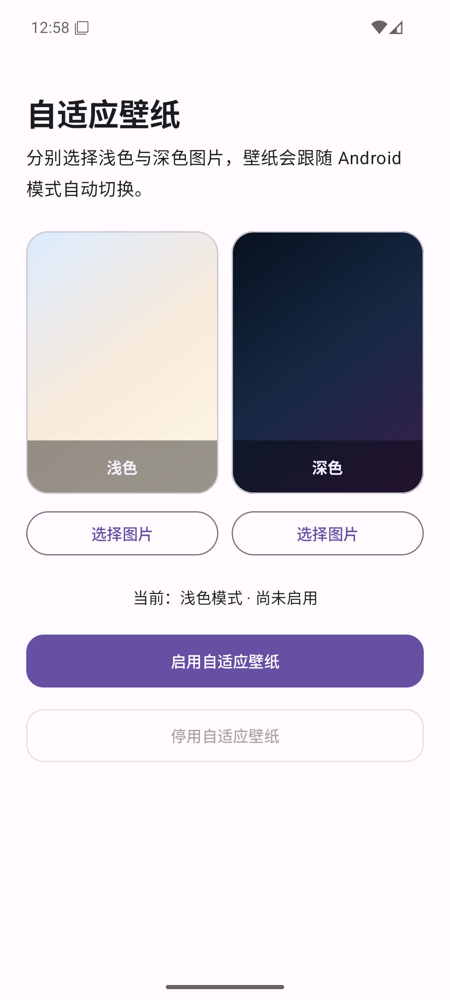
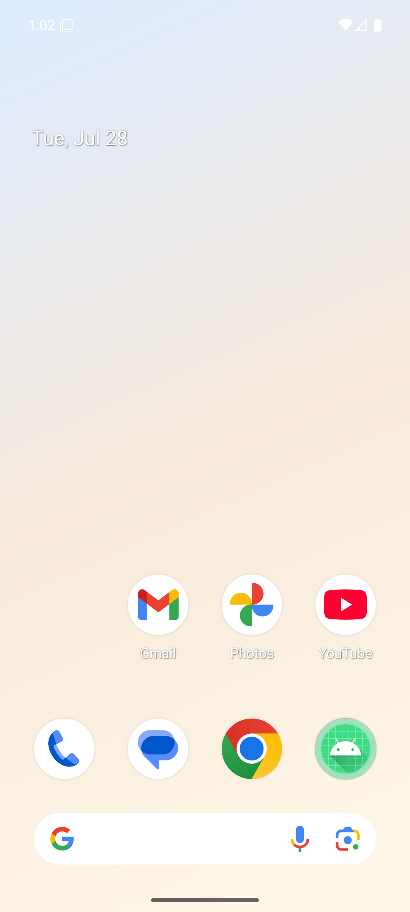
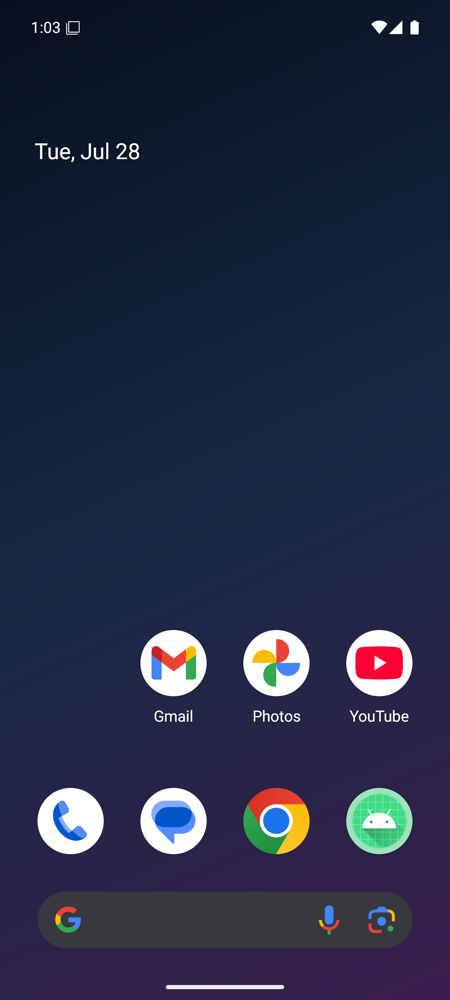

# AdaptiveWallpaper

[中文](README.md) · **English**

<p align="center">
  
</p>

A lightweight, open-source Android live wallpaper that automatically switches between user-selected images when Android changes between light and dark mode.

<p align="center">
  <a href="https://github.com/Lei-Tin/AdaptiveWallpaper/releases/latest/download/AdaptiveWallpaper.apk"><strong>Download the latest APK</strong></a>
  ·
  <a href="https://github.com/Lei-Tin/AdaptiveWallpaper/releases/latest">View releases</a>
</p>

## Demo

<p align="center">
  
  
  
</p>

<p align="center"><sub>Settings · Light mode · Dark mode</sub></p>

## Features

- Choose separate images for Android light and dark mode
- Crop, fit, or stretch each image
- Drag and pinch to position cropped images
- Apply the live wallpaper to the home screen, lock screen, or both
- Compatibility fallback for systems that do not reliably deliver theme callbacks, including some HyperOS devices
- Disable the service in the app and restore the Android default wallpaper
- No network permission; imported images stay in private, non-backed-up app storage
- English and Chinese interfaces

## Requirements

- Android 7.0 (API 24) or newer
- A device that supports Android live wallpapers

## Install

1. [Download the latest APK](https://github.com/Lei-Tin/AdaptiveWallpaper/releases/latest/download/AdaptiveWallpaper.apk).
2. Open `AdaptiveWallpaper.apk` after the download finishes.
3. If Android asks, allow your browser or file manager to install unknown apps.
4. Install future versions over the existing app. Uninstalling first removes the images and settings stored by the app.

GitHub installations do not update automatically. Download the latest APK again to install an update.

### Migrating from v1.x

Starting with v2.0.0, the application ID changes from `io.github.leitin.adaptivewallpaper` to `com.shouyihung.adaptivewallpaper`. Android treats it as a new app, so it cannot update v1.x in place. Install v2.0.0, select and enable your wallpapers again, then disable and uninstall the old app. Future v2.x releases can update in place.

## Use

1. Choose and adjust an image for light mode.
2. Choose and adjust an image for dark mode.
3. Tap **Enable adaptive wallpaper**.
4. In the Android system preview, tap **Set wallpaper** and choose the home screen, lock screen, or both.
5. Switch Android between light and dark mode to test automatic switching.

Closing the app or removing it from Recents does not stop the wallpaper because Android manages the live wallpaper service. To stop it, reopen the app and tap **Disable adaptive wallpaper**.

## Privacy

AdaptiveWallpaper requests no network permission and includes no analytics or advertising SDK. Imported images are stored in `noBackupFilesDir`, which excludes them from Android cloud backups. Crop settings remain in private app storage.

## Verify a download

Every GitHub Release includes a SHA-256 checksum file. Official APKs use this signing certificate:

```text
Package: com.shouyihung.adaptivewallpaper
Certificate: CN=Ray Hung
SHA-256: 4074b19aedde4215c747eb33ba53a05b42d2fb3d939862c01a5515809e9a32e8
```

## Build locally

```bash
./gradlew testDebugUnitTest lintDebug assembleDebug
```

The Debug APK is generated at `app/build/outputs/apk/debug/app-debug.apk`.

For a signed Release build, copy `keystore.properties.example` to `keystore.properties`, provide your own keystore details, and run:

```bash
./gradlew testDebugUnitTest lintRelease assembleRelease
```

Never commit a keystore or its passwords. Official updates must continue using the same signing certificate and increment `versionCode`.

## Contributing

Issues and pull requests are welcome. Read [CONTRIBUTING.md](CONTRIBUTING.md) before contributing. Report security problems privately as described in [SECURITY.md](SECURITY.md).

## License

Licensed under the [Apache License 2.0](LICENSE).
